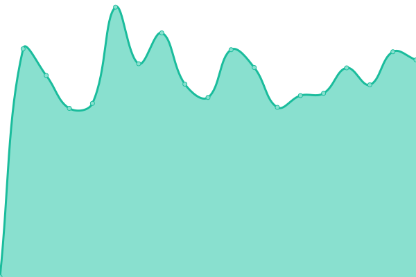

# [📈 Live Status](https://status.lianhe.art): <!--live status--> **所有系统与服务正常运行**

This repository contains the open-source uptime monitor and status page for [联合互娱](https://open.lianhehuyu.com), powered by [Upptime](https://github.com/upptime/upptime).

With [Upptime](https://upptime.js.org), you can get your own unlimited and free uptime monitor and status page, powered entirely by a GitHub repository. We use [Issues](https://github.com/UnionMusic/status/issues) as incident reports, [Actions](https://github.com/UnionMusic/status/actions) as uptime monitors, and [Pages](https://status.lianhe.art) for the status page.

<!--start: status pages-->
<!-- This summary is generated by Upptime (https://github.com/upptime/upptime) -->
<!-- Do not edit this manually, your changes will be overwritten -->
<!-- prettier-ignore -->
| URL | Status | History | Response Time | Uptime |
| --- | ------ | ------- | ------------- | ------ |
|  [静态资源 CDN](https://s2.16345.net/css/v2/icon.css) | Up | [cdn.yml](https://github.com/UnionMusic/status/commits/HEAD/history/cdn.yml) | 

 568ms
     
 | 

<a href="https://origin-status.16345.net/history/cdn">100.00%</a>
    

|  [图片资源 CDN](https://img.16345.net/images/lianhe-g.png) | Up | [cdn.yml](https://github.com/UnionMusic/status/commits/HEAD/history/cdn.yml) | 

 568ms
     
 | 

<a href="https://origin-status.16345.net/history/cdn">100.00%</a>
    

|  [LIANHE.ART 数字版权管理平台](https://d.lianhe.art/account/login) | Up | [lianhe-art.yml](https://github.com/UnionMusic/status/commits/HEAD/history/lianhe-art.yml) | 

 216ms
     
 | 

<a href="https://origin-status.16345.net/history/lianhe-art">100.00%</a>
    

|  LIANHE.ART 管理系统 | Up | [lianhe-art.yml](https://github.com/UnionMusic/status/commits/HEAD/history/lianhe-art.yml) | 

 216ms
     
 | 

<a href="https://origin-status.16345.net/history/lianhe-art">100.00%</a>
    

<!--end: status pages-->

[**Visit our status website →**](https://status.lianhe.art)

## 📄 License

- Powered by: [Upptime](https://github.com/upptime/upptime)
- Code: [MIT](./LICENSE) © [联合互娱](https://open.lianhehuyu.com)
- Data in the `./history` directory: [Open Database License](https://opendatacommons.org/licenses/odbl/1-0/)
